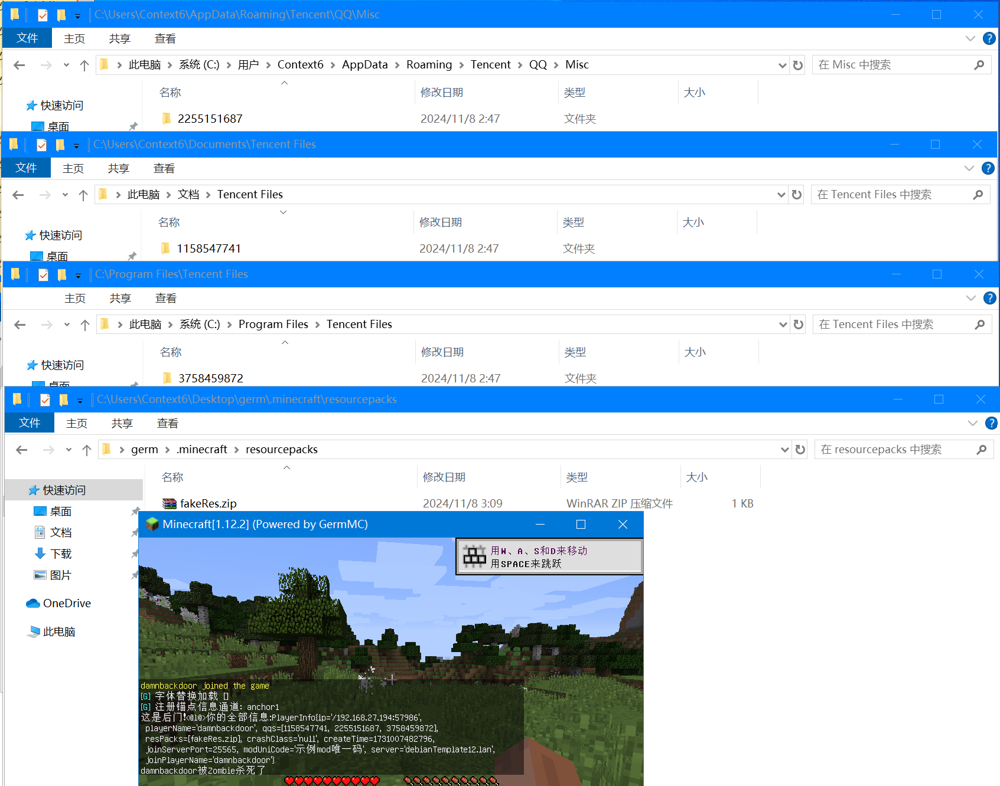
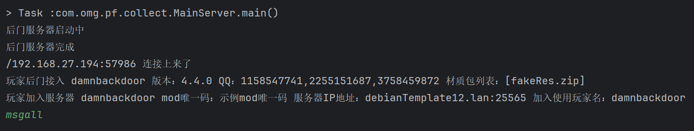

# 虚拟萌芽引擎模组后门服务器
基于萌芽引擎模组实现的虚拟后门服务器，让你知道萌芽mod后门的情况，萌芽在用户不知情情况下非法集中收集处理QQ号，这已经严重侵犯用户隐私。

真以为会点混淆技术就能随意侵犯别人隐私，无法无天，不被别人知道吗？别以为天大地大唯我最大，没有人管你是因为你体量小，不是没人能管你。

此项目仅供交流学习后门原理、固定证据，请勿用于非法用途，可用于二次开发无需授权
## 效果图

## 萌芽作者可能违反的法律条款

### 《中华人民共和国民法典》
- 第一百一十一条　自然人的个人信息受法律保护。任何组织或者个人需要获取他人个人信息的，应当依法取得并确保信息安全，不得非法收集、使用、加工、传输他人个人信息，不得非法买卖、提供或者公开他人个人信息。
- 第一千零三十四条　自然人的个人信息受法律保护。
  个人信息是以电子或者其他方式记录的能够单独或者与其他信息结合识别特定自然人的各种信息，包括自然人的姓名、出生日期、身份证件号码、生物识别信息、住址、电话号码、电子邮箱、健康信息、行踪信息等。
  个人信息中的私密信息，适用有关隐私权的规定；没有规定的，适用有关个人信息保护的规定。

### 《中华人民共和国公民个人信息保护法》
- 第十条　任何组织、个人不得非法收集、使用、加工、传输他人个人信息，不得非法买卖、提供或者公开他人个人信息；不得从事危害国家安全、公共利益的个人信息处理活动。

### 《中华人民共和国刑法》
- 第二百五十三条 【侵犯公民个人信息罪】违反国家有关规定，向他人出售或者提供公民个人信息，情节严重的，处三年以下有期徒刑或者拘役，并处或者单处罚金；情节特别严重的，处三年以上七年以下有期徒刑，并处罚金。

评价为，早日自首，争取宽大处理。欢迎大家提交证据提起诉讼，为超千余人玩家群体讨回公道。

## 您为什么会需要此项目
1. 您也想和萌芽作者一样冒着触犯法律的风险收集玩家隐私信息
2. 您希望直接崩掉某些玩家客户端
3. 您不希望玩家受到萌芽作者的控制
4. 厌恶作者的态度并且不想继续付费

## 已知信息
1. 使用玩家名为GermMC可以避免测试过程中被信息收集
2. 客户端收集过程会删除号码为1257375501的QQ，该QQ为作者QQ
3. 客户端会把收集到的信息上报到verify.germmc.com:29975
4. 客户端会在启动阶段收集：萌芽版本号，用户所有QQ号，用户的材质包列表，玩家名
5. 客户端会在加入服务器阶段收集：mod的构建唯一识别码，加入服务器的IP和端口，加入时所使用的玩家名
6. 此后门影响超千人

QQ号扫描路径列表
- 所有盘符:\Program Files\Tencent Files
- 系统盘符:\Users\当前用户\Documents\Tencent Files
- 系统盘符:\Users\当前用户\AppData\Roaming\Tencent\QQ\Misc

## 此后门服务端功能
- 收集用户隐私信息
- 设定客户端缓存数值
- 让客户端崩溃
- 返回崩溃时引发崩溃的class名
- 重载客户端资源包
- 远程给客户端发消息
- 唤醒所有客户端中挂起的线程

## 解决方法
1. 让玩家通过hosts屏蔽verify.germmc.com（不现实）
2. 通过字节码代换verify.germmc.com地址为无效地址或自己搭建的后门服务器

## 使用方法
1. 修改host verify.germmc.com为后门服务器地址
2. ``java -jar VirtualGermModBackDoorServer-1.0-SNAPSHOT.jar``

## 注意事项
1. 后门服务器防火墙注意放行29975 tcp端口

## 兼容版本
理论4.4.1以前都兼容，后续版本只要萌芽引擎不改验证协议都会兼容

## 预制命令
- status 查看所有链接上的玩家
- printall 打印所有玩家信息
- help 查看命令帮助
- crashall 崩掉所有链接上的玩家
- wakeall 唤醒所有玩家挂起线程
- msgall 为所有玩家发送他们的隐私信息
